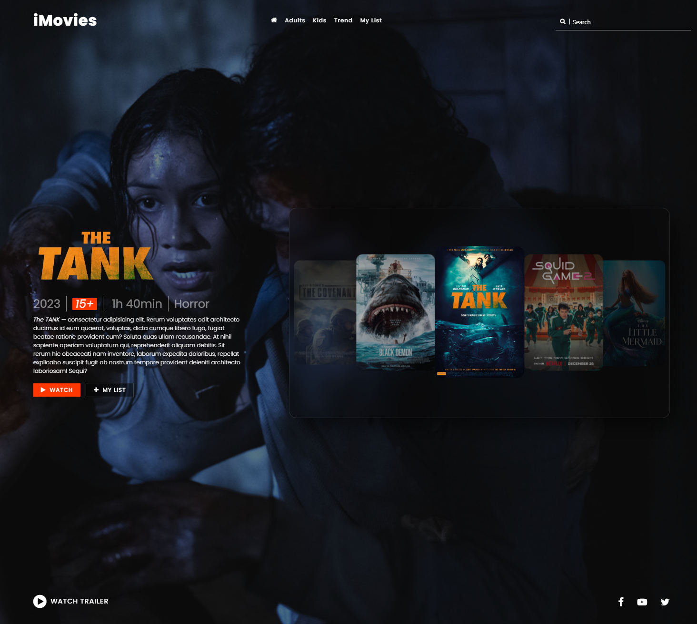
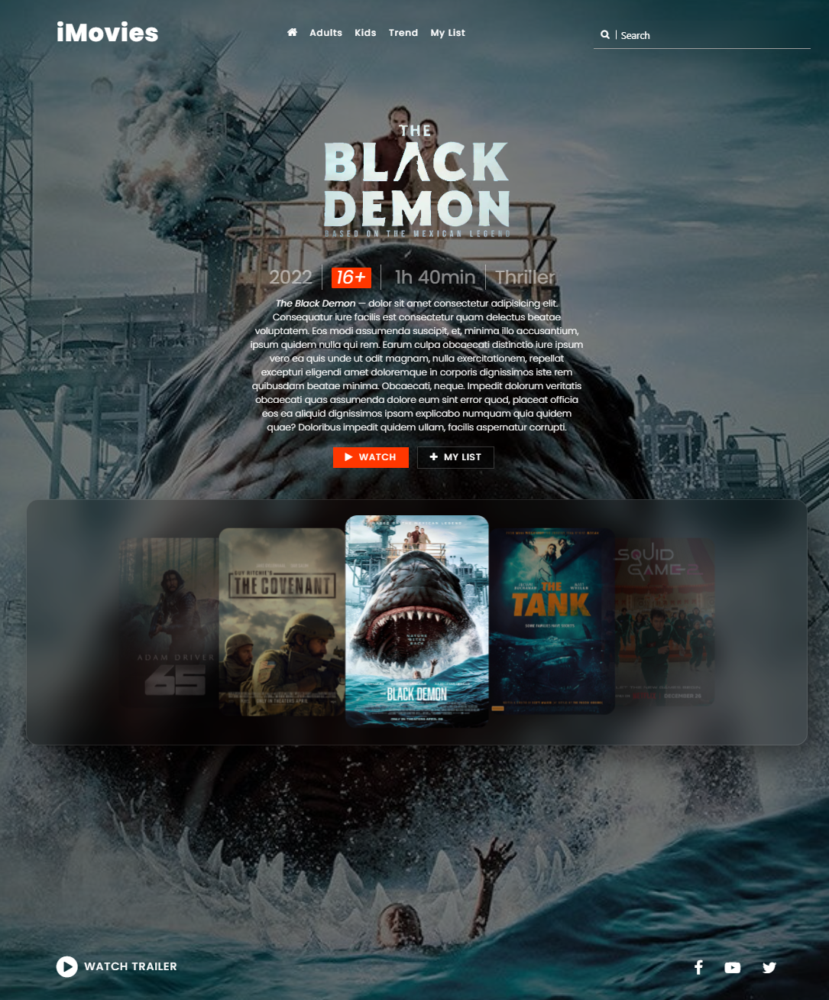

# **_Movie Poster website w/ movies slider animation_**

## About

Animated & Responsive Movie Poster Website Landing Page!
​
> version: Jan 2025, created by Gleb 'Faitsuma' Kiryakov

## Preshow

    
   
    
   
    
   
    
   
    
   

## Documentation

* Materialize: https://materializecss.com/getting-started.html;
* Font Awesome: https://fontawesome.com/v4/;
* Google Fonts: https://fonts.google.com;
* Color Picker: https://www.w3schools.com/colors/colors_picker.asp;

* HTML: https://developer.mozilla.org/en-US/docs/Web/HTML;
* CSS: https://developer.mozilla.org/en-US/docs/Web/CSS;
* SASS: https://sass-lang.com/documentation/;
* SASS compile hero pro extension: https://marketplace.visualstudio.com/items?itemName=Wscats.eno;
* jQuery: https://releases.jquery.com/;
* JavaScript: https://developer.mozilla.org/en-US/docs/Web/JavaScript;
* Git: https://githowto.com/ru;
